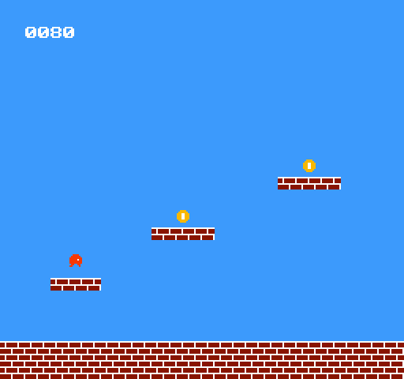

# NES ゲーム開発プロジェクト

ファミコン (NES) 用ゲームを cc65 ツールチェーン (ca65 アセンブラ) で開発するプロジェクト。

横スクロールの2画面ワールドを動き回り、8枚のコインを集めるアクション。
順番どおり連続で取るほど得点が増える（コンボ）。トゲや動く敵に触れると即ミスで最初から。
8枚すべて取るとゴール（金の星）が出現し、触れるとステージクリア。



## 開発環境

| 役割 | ツール | 状態 |
|------|--------|------|
| アセンブラ / リンカ | cc65 (ca65 / ld65) V2.18 | インストール済み |
| エミュレータ | FCEUX | `sudo apt install fceux` |
| ビルド | make | インストール済み |

## ディレクトリ構成

```
.
├── Makefile      ビルド定義
├── nes.cfg       ld65 リンカ設定 (NROM-256, mapper 0)
├── src/
│   └── main.s    メインソース (6502 アセンブリ)
├── images/       README 用スクリーンショット
├── work_log.md   開発ログ (進捗の詳細)
└── game.nes      ← ビルド生成物 (.gitignore 済み)
```

## 使い方

```bash
make        # game.nes をビルド
make run    # ビルドして FCEUX で起動
make clean  # 生成物を削除
```

## 操作

- 十字キー左右: 移動 / A ボタン: ジャンプ / Start: クリア後に最初から
- 次に取るコイン（点滅）を順番に取ると得点アップ。連続で取るほどボーナス増（最大8枚で447点）
- 順番外のコインも取れるが、取るとコンボがリセット（その分の点は32に戻る）
- トゲ・敵に触れると即ミスで最初から。8枚集めてゴール（金の星）に触れるとクリア

## メモ

- ROM 構成は NROM-256 (PRG 32KB + CHR 8KB, mapper 0)、垂直ミラーで横スクロール。
- 実装済み: コントローラ入力 / スプライト移動 / 重力・ジャンプ / 背景ステージ / 足場の当たり判定 / 横スクロール(2画面) / コイン収集＋コンボ得点 / トゲ・敵＋死亡リスタート / ゴール＋ステージクリア。詳細は `work_log.md`。
- このマシンの Mesa ハードウェアGLだと FCEUX が入力時にフリーズするため、`make run` は `LIBGL_ALWAYS_SOFTWARE=1` 付きで起動する。
